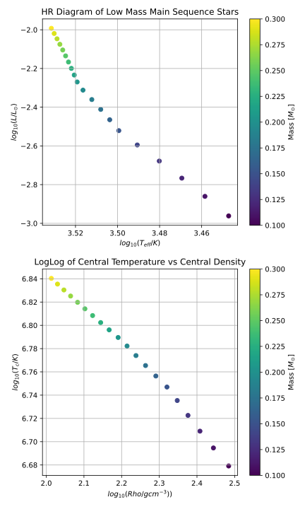
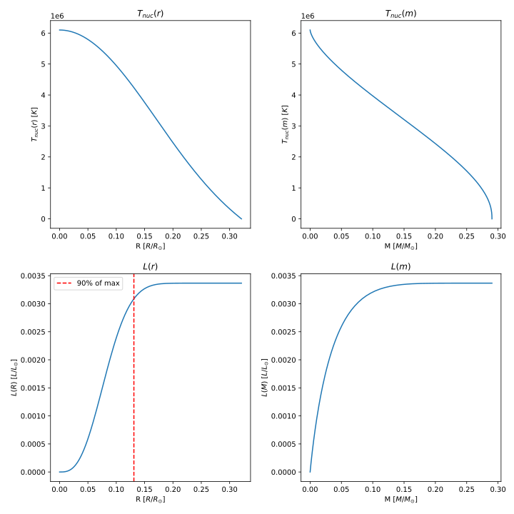

# 
AST 304 Project 3 Write Up

### 
Abram Anderson, Hannah Sullivan, Steven VanCamp, Sanskriti Verma

 

## Contents
1. Parameter Analysis and Function Testing
2.  [Plotting log(L/L⊙) against log(Teff/K) and og(Tc/K) against log(ρc/g cm−3)] (https://github.com/vancam25/AST304_star_society/blob/main/Project_3/FinalPlots/Part_10_plots.svg_) 
3.  [Plot T(r), T(m), L(r), and L(m) for a star with M = 0.3 M⊙] (https://github.com/vancam25/AST304_star_society/blob/main/Project_3/FinalPlots/Part_11_plots.svg)
4.  [Changing pp_factor in pp_rate]

## Prameter Analysis and Function Testing

All functions passed testing, and additionally the parameters we found from project 2 we managed to verify and reuse again. (The original files can be found in the Parameter Analysis file, https://github.com/vancam25/AST304_star_society/tree/main/Project%20%232/ParamAnalysis, or in the final write up.) The values we used can be found in `proj_3_config.ini`. The values for central pressure, density is 0.77 GM2/R4 and 5.99 3M/(4πR3) we verified additionally in project 2 as well, in the Mass-Radius relationship table in our write up. (https://github.com/vancam25/AST304_star_society/blob/main/Project%20%232/Project_2_WriteUp.md) 

## Plotting log(L/L⊙) against log(Teff/K) and log(Tc/K) against log(ρc/g cm−3)

For part 2.10, there were two parts (a) and (b) in which we needed to graph a) log(L/L⊙) against log(Teff/K) and b) log(Tc/K) against log(ρc/g cm−3). Specified in (a), we made sure to have the graph's axis for log(Teff/K) "backwards". Our plots is below. 

###### 
 Figure 1 Top plot: log(L/L⊙) against log(Teff/K) for 0.1M⊙ < M < 0.3M⊙. Bottom plot: log(Tc/K) against log(ρc/g cm−3) for 0.1M⊙ < M < 0.3M⊙.

We managed to reproduce the very bottom part of Figure 15 in Paxton et al. Creating these plots required us to integrate over the stars' structure with the integrate function in `structure.py`. In order to do this, we first created a range of masses (i.e. 0.1M⊙ < M < 0.3M⊙) and specify a radius to converge to (we chose Rwant = 0.33 R⊙). We additionally needed our value of mue, $\xi$, $\eta$, our star's composition, the pp_factor, and our offset values for mass and radius. The function that we created for part 2.9- titled the same as the file it's in- `Compute_L.py`- calls on the temperature and luminosity funcion in `zams.py` in 2.8, as well as the integrate function in `structure.py`. The radius was computed at the same time as the effective temperature (using Teff in `zams.py`), the surface luminosity (using surface)luminosity in `zams.py`), and the central pressure, central density, and central temperature from the central thermal function in `structure.py`. After that, we plotted our needed results with the correct axes and units. 

## Plot T(r), T(m), L(r), and L(m) for a star with M = 0.3 M⊙

Part 2.11 asked for plots of T(r), T(m), L(r), and L(m) for a star with M = 0.3 M⊙. Additionally, we set out to answer the question of "what
radius does L(r) reach 90% of its final value?" To answer the question, we specifically used the integrate function from `structure.py` for M = 0.3 M⊙ and plotted the values that were returned to us (mass array m, temperature array T, luminosity array l, and radius array r). Our plots are below. 

###### 
 Figure 2 Top left plot: Temperature Tnuc vs radius R. Top right plot: Temperature Tnuc vs mass M. Bottom left plot: Luminosity L vs radius R. The dashed red line represents 90% of the final value of L. Bottom right plot: Luminosity L vs mass M. 

One very important part of this result is the red line on the bottom left plot, of luminosity vs radius. We see that the luminosity as a function of radius reaches 90% of it's final value at 0.13 R⊙, and also in addition, the mass fraction that corresponds to this radius is 0.29 M⊙. 

## Changing pp_factor in pp_rate

For part three, we had to change the pp_factor for the pp_rate function from 1 to 10^5. To compare the changes, we reran the code used in part 2.10 but with the slight change to the pp_factor. We made sure to save the initial run from 2.10 so we had it for comparison. Both the initial 2.10 run and the run with the changed pp_factor are saved as .csv files in the `FinalPlots` folder; the files being `integrate_results_pp_f_1.csv` and `integrate_results_pp_f_10_5.csv`. An excel file- `part3_comparison.xlsx`- holds the actual comparison ebtween the two, in order to see the two better. Weak refers to the run with pp_factor = 1 and strong refers to the run with pp_factor = 10^5. 

As you can see, the radius changes between the two runs by over a factor of 2, and the luminosity by over a factor of 6. (Additionally, as seen in the individual .csv files, the pressure increases and density decreases.) The temperature corresponds the same to each value of mass as it had in the initial run, since Teff is calculated with a wanted mass M value. So, as the pp_factor is increased, the radius of the star increases to accompany this change, as does the luminosity (as there are more reactions happening, and so there are more photons being produced). 

If the Sun had similar changes to it's structure, we think that the habitable zone would move, and we'd most likely be roasted. The habitable zone for a star depends on the star's luminosity, so if the sun's luminosity got similarly upgraded, we would see surfaces temperatures on Earth rise to the point that life would most likely be unsustainable. In short, it is very unlikely that we would still be around. 
